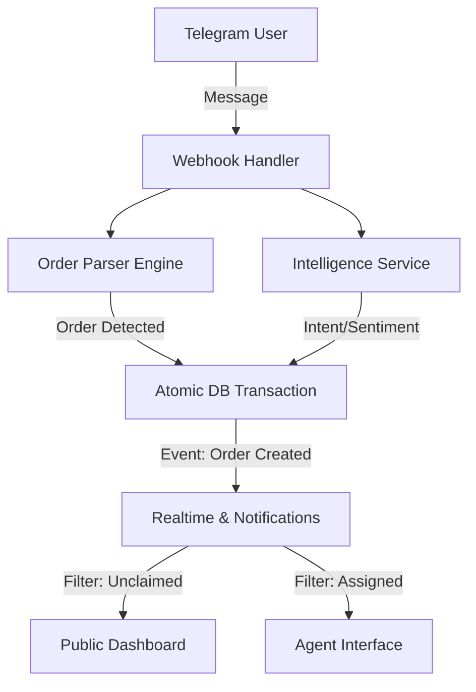

# 🚀 LeadSync Architecture Redesign: Privacy-First, High-Performance, Limitless Scaling

**Version:** 2.0 (Gemini Pro 3 Optimized)
**Date:** 2026-02-19
**Focus:** Revenue Optimization, Strict Privacy, Real-Time Reliability

---

## 1. 🏗️ High-Level Architecture Overview

We are moving from a simple "Request-Response" model to an **Event-Driven, Multi-Agent Architecture**.



---

## 2. 🍔 Module 1: Reliable Order Detection (Hybrid Engine)

**Problem:** Current system misses orders or relies solely on manual entry.
**Solution:** A **Hybrid Deterministic + AI Pipeline**.

### The Flow
1.  **Stage 1: Regex Matcher (Instant)** -> Checks for patterns like `\d+ x [Item Name]` or `\d+ [Item Name]`. High confidence, zero latency.
2.  **Stage 2: AI Parser (Fallback)** -> Interprets complex natural language ("I'll have two burgers and a coke").
3.  **Stage 3: Validation** -> cross-references with `botStructuredMenu` to resolve entity names.

### Implementation Logic (`OrderParserService`)
```typescript
async function parseOrder(text, menu) {
  // 1. Fast Regex Check
  const regexMatches = extractRegexOrders(text, menu);
  if (regexMatches.confidence > 0.9) return regexMatches;

  // 2. AI Fallback (Groq 8b)
  return await extractAIOrders(text, menu);
}
```

---

## 3. 💰 Module 2: Revenue-Based Prioritization (The "Ranker")

**Problem:** Agents pick easy leads, not valuable ones.
**Goal:** Auto-sort leads by **Revenue Potential**.

### The "Money Score" Formula
Each conversation gets a `priorityScore` calculated as:

$$
Score = (P \times 1.0) + (L \times 0.5) + (S \times 10) + (W \times 2) + (R \times 20)
$$

Where:
*   **P (Potential Value):** Current cart value or AI predicted value.
*   **L (Lifetime Value):** Total past spend of this lead.
*   **S (Sentiment):** Negative sentiment gets *higher* priority (-5 score = +50 points) to prevent churn.
*   **W (Wait Time):** Minutes since last reply.
*   **R (Retention):** Is repeat customer? (+20 flat bonus).

### SQL Optimization
We precompute this score on every relevant event (New Message, New Order) so the dashboard query is effectively:

```sql
SELECT * FROM "Conversation"
WHERE status = 'OPEN'
ORDER BY "priorityScore" DESC, "createdAt" ASC
LIMIT 50;
```
*No complex joins allowed in the main list query.*

---

## 4. 🛡️ Module 3: Strict Privacy Isolation (The "Vault")

**Problem:** All agents see all data.
**Solution:** **Hard Isolation** via RLS and Backend Filtering.

### Access Control Matrix
| Role | Unclaimed (Open) | Assigned (Me) | Assigned (Others) |
| :--- | :---: | :---: | :---: |
| **Owner** | ✅ | ✅ | ✅ |
| **Admin** | ✅ | ✅ | ✅ |
| **Agent** | ✅ | ✅ | ❌ **FORBIDDEN** |

### Implementation Strategy
1.  **Database:** Postgres RLS Policies (Row Level Security) enforce that `SELECT * FROM Conversation` only returns allowed rows.
2.  **Backend:** API routes explicitly filter `where: { OR: [{ assignedToId: null }, { assignedToId: me }] }`.
3.  **Realtime:** Socket events are emitted to specific rooms: `company:unclaimed` or `user:{agentId}`.

---

## 5. 🔔 Module 4: Real-Time Notifications (The "Pulse")

**Problem:** Delays and missed alerts.
**Solution:** **Persistent Notification Table + Socket Push**.

### DB Schema Update
```prisma
model Notification {
  id        String   @id @default(uuid())
  userId    String
  title     String
  body      String
  type      String   // ORDER, MESSAGE, ALERT
  isRead    Boolean  @default(false)
  createdAt DateTime @default(now())

  @@index([userId, isRead])
}
```

### Event Flow
1.  **Event happens** (e.g., High Value Order).
2.  **Server creates `Notification` record**.
3.  **Server emits** `socket.to(`user:${userId}`).emit('notification', payload)`.
4.  **Client shows Toast** and increments unread badge.
5.  **Offline Support:** When agent logs in, fetch unread notifications.

---

## 6. ⚡ Module 5: Dashboard Performance (The "Speed")

**Problem:** 60s load time.
**Root Cause:** Full table scans on `Order` and `Conversation` with heavy joins.

### Optimization Plan
1.  **Indexing:**
    *   `Conversation(companyId, status, priorityScore DESC)` -> For main dashboard list.
    *   `Message(conversationId, createdAt DESC)` -> For chat history.
    *   `Order(companyId, status)` -> For order board.

2.  **Pagination:**
    *   Implement cursor-based pagination for messages (infinity scroll).
    *   Limit Dashboard list to top 50 prioritized leads.

3.  **Query Splitting:**
    *   Do NOT fetch `messages` when fetching `conversations` list.
    *   Fetch `counts` (Revenue, Leads) in a separate parallel query or use a cached `Stats` table.

---

## 7. 🛠️ Implementation Roadmap

1.  **Phase 1: DB & Performance (Foundations)**
    *   Apply Indexes.
    *   Implement RLS.
2.  **Phase 2: Order Engine**
    *   Build `OrderParserService`.
    *   Hook into Webhook.
3.  **Phase 3: Revenue Ranker**
    *   Update Schema (`priorityScore`).
    *   Implement Scoring Logic.
4.  **Phase 4: Notifications**
    *   Create `Notification` table.
    *   Wire up Socket events.

This architecture ensures LeadSync scales to thousands of orders while keeping data secure and the interface snappy.
